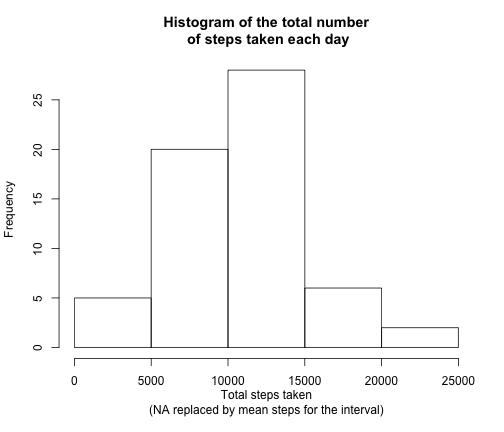
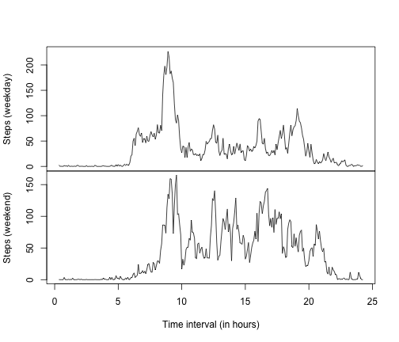

Peer Assessment #1
========================================================

This assignment makes use of data from a personal activity monitoring device. This device collects data at 5 minute intervals through out the day. The data consists of two months of data from an anonymous individual collected during the months of October and November, 2012 and include the number of steps taken in 5 minute intervals each day.

The variables included in the 'activity' dataset are:

steps: Number of steps taking in a 5-minute interval (missing values are coded as NA)

date: The date on which the measurement was taken in YYYY-MM-DD format

interval: Identifier for the 5-minute interval in which measurement was taken

The dataset is stored in a comma-separated-value (CSV) file and there are a total of 17,568 observations in this dataset.

### Loading and preprocessing the data:


```r
# assuming we are in the correct working directory load the activity monitoring data
file <- read.csv('activity.csv')
# preprocessing is not necessary at this point; attach the file to make the objects directly accessible
```

### What is mean total number of steps taken per day?

The total number of steps taken per day:

```r
# Calculate the total number of steps taken per day
total_steps <- rowsum(file$steps,format(file$date))
colnames(total_steps) <- c('Total Steps Taken')
```


```r
# Make a histogram of the total number of steps taken each day
hist(total_steps, main="Histogram of the total number\n of steps taken each day", xlab="Total steps taken each day")
```

 


```r
# Calculate and report the mean and median of the total number of steps taken per day
total_steps_num <- as.numeric(gsub("^.{10}", "", total_steps))
mean_total_steps <- mean(total_steps_num, na.rm = TRUE)
median_total_steps <- median(total_steps_num, na.rm = TRUE)
```

The mean of the total number of steps taken per day is 10766.19.
The median of the total number of steps taken per day is 10765.

### What is the average daily activity pattern?
  

```r
# Make a time series plot of the 5-minute interval (x-axis) and the average number 
# of steps taken, averaged across all days (y-axis)
interval_steps <- file[order(file$interval),]

# steps and interval values should be numeric
interval_steps$steps <- as.numeric(interval_steps$steps)
interval_steps$interval <- as.numeric(interval_steps$interval)

# we don't need the date column for this graph
interval_steps$date <- NULL

# get the rowsum of steps for each interval
sum_steps <- rowsum(file$steps,format(file$interval), na.rm = TRUE)

# get how many records are present for each interval
count_per_interval <- length(which(interval_steps$interval == 2355))

# get the average of the total steps taken
sum_steps <- data.frame(sum_steps)
sum_steps$ave <- sum_steps$sum_steps/count_per_interval

# save data to a new variable, delete the sum_steps column and create the timeseries plot 
ave_steps <- sum_steps
ave_steps$sum_steps <- NULL
ave_steps <- data.frame(ave_steps)
ave_steps_timeseries <- ts(ave_steps, frequency=12, start=c(0,5))

# create the graph
plot(ave_steps_timeseries, type='l', main='Time series plot of 5-minute intervals\n and average number of steps', ylab='Average steps taken', xlab='Time interval (in hours)')
```

 


```r
# Which 5-minute interval, on average across all the days in the dataset, contains the maximum number of steps?

# get the maximum steps taken and get the corresponding interval of its row
max_steps <- max(sum_steps$sum_steps)
max_steps_row <- sum_steps[which(sum_steps$sum_steps==max_steps),]
max_steps_interval <- rownames(max_steps_row)
```

On average across all the days in the dataset, the interval 835 contains the maximum number of steps.

### Imputing missing values


```r
# Calculate and report the total number of missing values in the dataset
missing_values <- sum(is.na(file$steps))
```

The total number of missing values for 'steps' is 2304.


```r
# Devise a strategy for filling in all of the missing values in the dataset

# create a new dataset that is equal to the original dataset but with the missing data filled in
interval <- as.numeric(rownames(ave_steps))
ave_steps_with_interval <- cbind(ave_steps, interval)
ave_steps_with_interval <- data.frame(ave_steps_with_interval)

# the approach to imputting mean values below was based on several suggestions 
# found in forum discussion on the topic "Peer assessment 1 - Imputing missing values, step 2"

# copy data to new_file and assign index to NA values
new_file <- file
NA_index <- which(is.na(new_file$steps))

# replace NA values in 'steps' in new_file with the corresponding value for 'ave_steps' 
# in ave_steps_with_interval based on index of same interval
for (i in NA_index) {new_file$steps[i] <- with(ave_steps_with_interval, ave[interval == new_file$interval[i]])}

missing_values_in_new_file <- sum(is.na(new_file$steps))
```

There are 0 missing values in new_file after imputting the mean values for NA.


```r
# Make a histogram of the total number of steps taken each day

total_steps <- rowsum(new_file$steps,format(new_file$date))
colnames(total_steps) <- c('Total Steps Taken')
hist(total_steps, main="Histogram of the total number\n of steps taken each day", xlab="Total steps taken\n(NA replaced by mean steps for the interval)")
```

 


```r
# Calculate and report the mean and median of the total number of steps taken per day
total_steps_num <- as.numeric(gsub("^.{10}", "", total_steps))
mean_total_steps_filled_in <- mean(total_steps_num, na.rm = TRUE)
median_total_steps_filled_in <- median(total_steps_num, na.rm = TRUE)
```

After imputting missing values:

The mean of the total number of steps taken per day is 116852.3.

The median of the total number of steps taken per day is 11458.

These values differ from the estimates from the first part of the assignment as follows:
the mean increased by 106086 and the median increased by 693 after the missing values have been imputted.

The impact of imputing missing data on the estimates of the total daily number of steps is increasing both the mean and median and improving the estimate for both values.

### Are there differences in activity patterns between weekdays and weekends?

The dataset with the filled-in missing values was used for this part of the analysis


```r
# Create a new factor variable in the dataset with two levels – “weekday” and “weekend”
new_file$day <- NA
new_file$day <- weekdays(as.Date(new_file$date))

# make 'recode' available
library(car)
```

```
## Warning: package 'car' was built under R version 3.1.2
```

```r
new_file$day <- recode(new_file$day, "c('Monday','Tuesday', 'Wednesday', 'Thursday', 'Friday')='weekday'")
new_file$day <- recode(new_file$day, "c('Saturday','Sunday')='weekend'")
```


```r
# Make a panel plot containing a time series plot of the 5-minute interval (x-axis) and the average number of steps taken,
# averaged across all averaged across all weekday days or weekend days (y-axis)

# order the data by interval and subset into weekday and weekend records
interval_steps <- new_file[order(new_file$interval),]
interval_steps$steps <- as.numeric(interval_steps$steps)
interval_steps$interval <- as.numeric(interval_steps$interval)
interval_steps_weekday <- interval_steps[ which (interval_steps$day == 'weekday'),]
interval_steps_weekend <- interval_steps[ which (interval_steps$day == 'weekend'),]

# remove unnecessary columns
interval_steps_weekday$date <- NULL
interval_steps_weekend$date <- NULL
interval_steps_weekday$day <- NULL
interval_steps_weekend$day <- NULL

# get the sum of steps per interval
sum_steps_weekday <- rowsum(interval_steps_weekday$steps,format(interval_steps_weekday$interval), na.rm = TRUE)
sum_steps_weekend <- rowsum(interval_steps_weekend$steps,format(interval_steps_weekend$interval), na.rm = TRUE)

# count the records per interval
count_per_interval_weekday <- length(which(interval_steps_weekday$interval == 2355))
count_per_interval_weekend <- length(which(interval_steps_weekend$interval == 2355))

# compute the average steps taken
sum_steps_weekday <- data.frame(sum_steps_weekday)
sum_steps_weekend <- data.frame(sum_steps_weekend)  
sum_steps_weekday$ave <- sum_steps_weekday$sum_steps_weekday/count_per_interval_weekday
sum_steps_weekend$ave <- sum_steps_weekend$sum_steps_weekend/count_per_interval_weekend

# save data to a new variable, delete the sum_steps column and create the timeseries plot 
ave_steps_weekday <- sum_steps_weekday
ave_steps_weekend <- sum_steps_weekend
ave_steps_weekday$sum_steps_weekday <- NULL
ave_steps_weekend$sum_steps_weekend <- NULL

ave_steps_weekday <- data.frame(ave_steps_weekday)
ave_steps_weekend <- data.frame(ave_steps_weekend)

ave_steps_timeseries_weekday <- ts(ave_steps_weekday, frequency=12, start=c(0,5))
ave_steps_timeseries_weekend <- ts(ave_steps_weekend, frequency=12, start=c(0,5))

par(mfrow=c(2,1))
par(mar=c(0,4.1,4.1,2.1))
plot(ave_steps_timeseries_weekday, type='l', xlab = '', xaxt='n', ylab='Steps (weekday)')
par(mar=c(5.1,4.1,0,2.1))
plot(ave_steps_timeseries_weekend, type='l', xlab='Time interval (in hours)',  ylab='Steps (weekend)')
```

 

```r
# restore default margins
par(mar=c(5.1,4.1,4.1,2.1))
```
